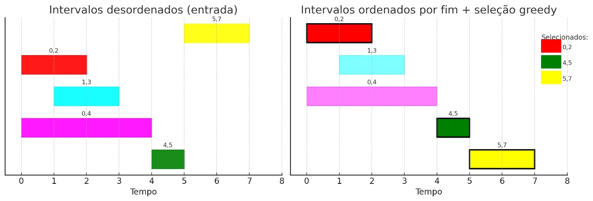
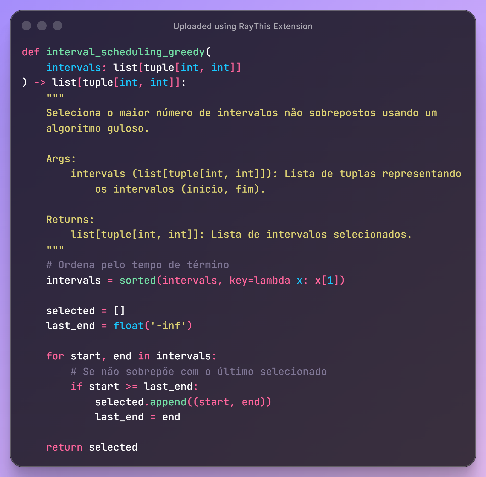
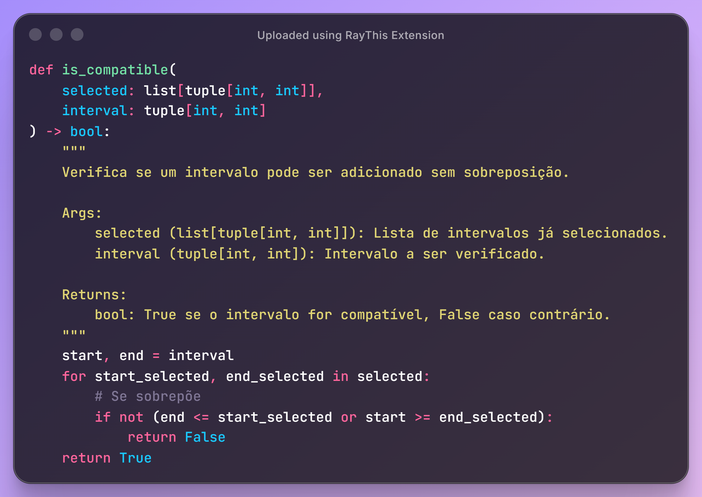
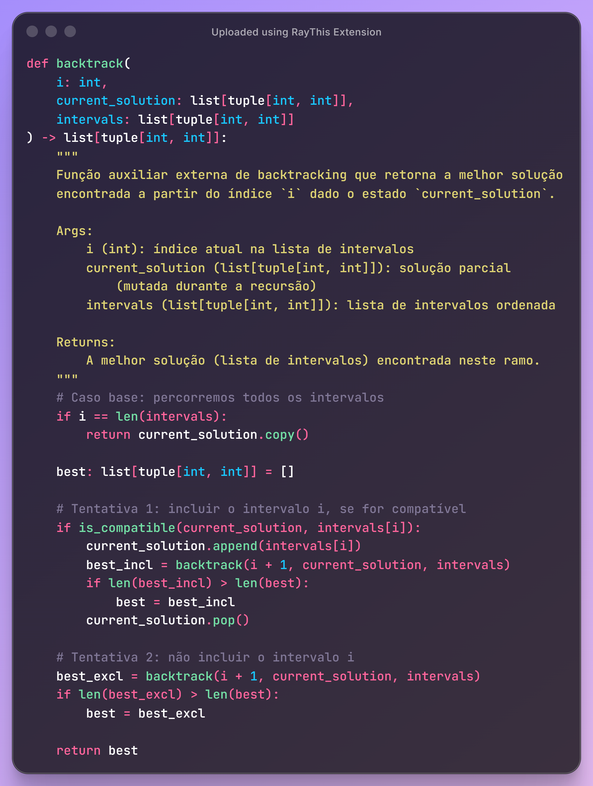
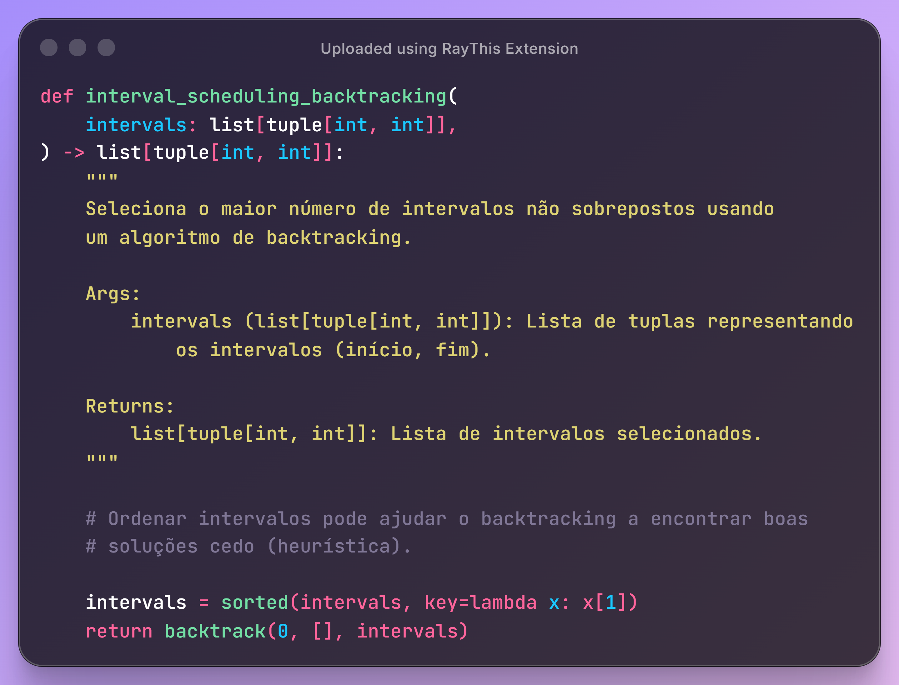
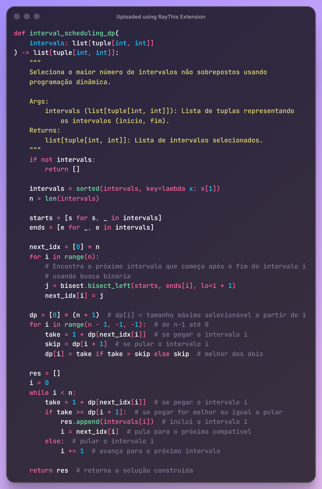
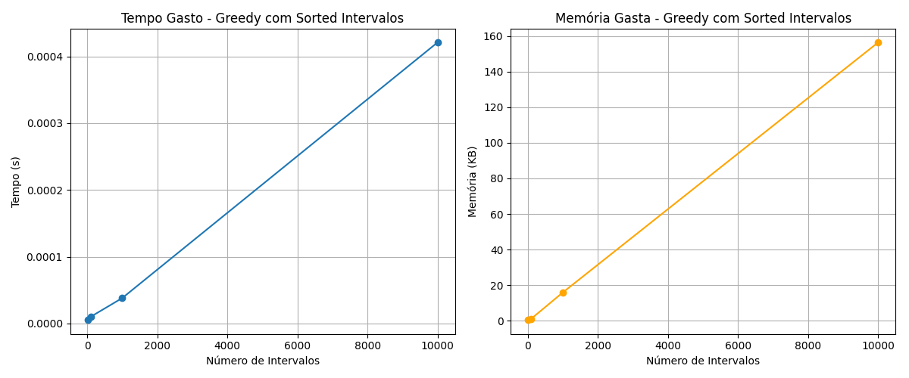
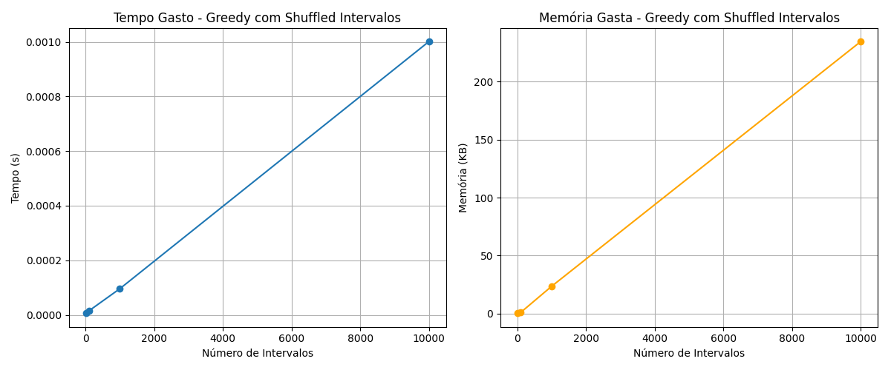
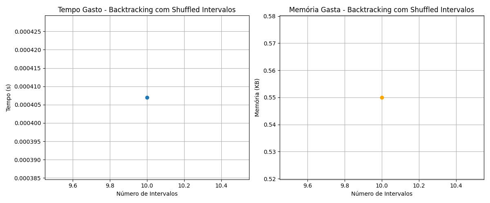

# Investigando o Problema *Interval Scheduling* com Algoritmos *Greedy*, *Backtracking* e Programação Dinâmica

Equipe:

Mauricio Benjamin da Rocha

Pedro Antônio Vital de Sousa Carvalho

## 1. Objetivo do Trabalho

O presente trabalho tem por objetivo analisar comparativamente duas abordagens algorítmicas aplicadas ao problema clássico de *Interval Scheduling*: o Algoritmo *Greedy* (Guloso) e o *Backtracking*. A investigação busca compreender, de forma sistemática, como cada método se comporta na resolução do problema, considerando suas diferenças estruturais, operacionais e computacionais.

Para tanto, são avaliados os seguintes aspectos:

- **Tempo de execução**, a fim de verificar a eficiência temporal de cada abordagem;
- **Consumo de memória**, permitindo identificar o custo computacional associado ao processamento;
- **Qualidade da solução**, com foco na capacidade dos algoritmos em selecionar o maior número possível de intervalos não sobrepostos;
- **Escalabilidade**, observando o desempenho dos métodos diante do aumento progressivo da quantidade de dados.

A análise é conduzida por meio de experimentação computacional utilizando conjuntos de dados compostos por 10, 100, 1000 e 10.000 intervalos, organizados em diferentes padrões (ordenados, aleatórios e embaralhados). Esses conjuntos possibilitam a avaliação das abordagens em cenários distintos, proporcionando uma comparação ampla e tecnicamente fundamentada.

Espera-se, com este estudo, identificar as potencialidades e limitações de cada algoritmo, bem como fornecer subsídios que orientem a seleção das técnicas mais adequadas à resolução de problemas de agendamento em contextos reais e acadêmicos.

## 2. Descrição do Problema

O problema de *Interval Scheduling* consiste em determinar o maior subconjunto possível de intervalos que não apresentem sobreposição temporal entre si. Cada intervalo representa uma tarefa, atividade ou evento associado a um tempo de início e um tempo de término. A solução exige a seleção de um conjunto de intervalos mutuamente compatíveis, de modo que nenhum deles ocorra simultaneamente.

Trata-se de um problema amplamente estudado na área de algoritmos e estruturas de dados, em razão de sua aplicabilidade em diferentes contextos práticos. Entre as situações mais frequentes destacam-se:

- Agendamento de salas ou recursos compartilhados, nos quais múltiplas solicitações disputam o mesmo espaço;
- Gerenciamento de tarefas em sistemas computacionais, onde processos precisam ser executados sem conflito;
- Otimização de cronogramas, incluindo a organização eficiente de atividades em ambientes educacionais, corporativos ou industriais.

A Figura 1 apresenta uma comparação visual entre dois cenários fundamentais para a compreensão do problema. No primeiro, observa-se um conjunto de intervalos dispostos de forma desordenada, representando a maneira como os dados costumam chegar em aplicações reais. No segundo cenário, esses mesmos intervalos são exibidos após serem ordenados pelo tempo de término e processados pelo algoritmo *Greedy*. A imagem evidencia que a ordenação prévia exerce papel decisivo na eficiência da seleção, uma vez que possibilita ao algoritmo identificar rapidamente os intervalos mais curtos e menos conflitantes, construindo uma solução não sobreposta de maneira simples e eficaz. Assim, a figura ilustra a importância da estruturação adequada dos dados para o desempenho das estratégias algorítmicas utilizadas na resolução do *Interval Scheduling*.

**Figura 1**: Comparação entre intervalos desordenados e ordenados, ilustrando como a ordenação é fundamental para estratégias eficientes como *Greedy*.

Além de demonstrar o comportamento visual dos intervalos, a imagem reforça como pequenas mudanças na organização dos dados podem impactar significativamente o resultado final. Dessa forma, a análise do problema se apresenta não apenas como um exercício conceitual, mas como base para a comparação entre diferentes paradigmas algorítmicos, possibilitando a investigação de suas implicações práticas em termos de eficiência, exatidão e escalabilidade.

### 2.1 Algoritmo Greedy (Guloso)

O algoritmo *Greedy* constitui uma das abordagens para a resolução do problema de Interval Scheduling. Seu princípio fundamental consiste em selecionar, a cada etapa, o intervalo que apresenta o menor tempo de término entre todos os disponíveis. Essa escolha local, que privilegia o encerramento mais rápido de cada tarefa, conduz de forma provada a uma solução globalmente ótima, independentemente da ordem inicial dos intervalos fornecidos.

O funcionamento do método baseia-se em duas etapas principais. Em primeiro lugar, todos os intervalos são ordenados crescentemente pelo instante de término. Essa ordenação é fundamental, pois permite que o algoritmo processe os intervalos em uma sequência que maximiza as chances de compatibilidade entre eles. Em seguida, percorre-se essa lista de maneira linear, selecionando apenas os intervalos cujo tempo de início não conflita com o término do último intervalo já incluído na solução parcial. Dessa forma, o algoritmo constrói incrementalmente o conjunto de intervalos não sobrepostos.

Do ponto de vista computacional, o algoritmo apresenta excelente desempenho. Sua complexidade é dominada pela ordenação inicial, resultando em um custo de O(n log n), seguido de uma varredura linear de custo O(n). Além disso, o *Greedy* utiliza memória mínima, uma vez que mantém apenas a lista de intervalos selecionados e uma variável auxiliar de controle.

A Figura 2 apresenta o código-fonte correspondente à implementação do algoritmo *Greedy* em Python. O trecho evidencia a simplicidade estrutural da abordagem:

- Inicialmente, os intervalos são ordenados pelo tempo de término, utilizando a função sorted com um lambda function;
- Cria-se a variável last_end, responsável por armazenar o instante final do último intervalo escolhido;
- Percorre-se a lista ordenada e, para cada intervalo (start, end), verifica-se se seu início é maior ou igual ao valor de last_end;
- Caso a condição seja satisfeita, o intervalo é adicionado ao conjunto de selecionados, e last_end é atualizado.

**Figura 2**: Código-fonte do algoritmo *Greedy* usado no experimento.

### 2.2 Algoritmo de Backtracking

O algoritmo de *Backtracking* constitui uma abordagem exaustiva utilizada para explorar todas as combinações possíveis de intervalos a fim de determinar o maior subconjunto que não apresente sobreposições. Diferentemente da estratégia *Greedy*, que realiza escolhas locais e eficientes, o *Backtracking* avalia sistematicamente cada possibilidade, realizando decisões binárias sucessivas: incluir ou não incluir cada intervalo na solução parcial. Esse processo é representado por uma árvore de decisões em que cada nível corresponde a uma escolha referente a um intervalo específico.

A principal vantagem dessa abordagem consiste na garantia, uma vez que todas as soluções potenciais são examinadas. No entanto, essa mesma característica faz com que o algoritmo apresente complexidade exponencial, aproximadamente O(2ⁿ), o que o torna impraticável para conjuntos de tamanho elevado. Por essa razão, sua utilização é adequada apenas em instâncias pequenas ou em contextos de natureza didática e experimental, nos quais se busca compreender a estrutura do problema ou comparar métodos de resolução.

A Figura 3 apresenta a função auxiliar *is_compatible*, responsável por verificar se um novo intervalo pode ser adicionado à solução parcial sem gerar sobreposição. A função percorre a lista de intervalos já selecionados e compara seus limites de início e término com o intervalo candidato, garantindo que apenas combinações válidas sejam exploradas.

**Figura 3**: Função *is_compatible* utilizada para verificar se um intervalo pode ser incluído na solução parcial sem gerar sobreposição.

A Figura 4 ilustra a função principal do *backtrack*, que implementa a lógica central da técnica. Para cada intervalo, o algoritmo realiza duas tentativas: a primeira consiste em incluir o intervalo, desde que seja compatível com os já selecionados; a segunda, em ignorar o intervalo e seguir para o próximo. Ambas as ramificações são exploradas recursivamente, e a melhor solução encontrada entre elas é retornada ao final da execução. O uso de recursão, combinado com a remoção controlada de elementos da solução parcial, permite que o algoritmo explore a árvore de possibilidades sem comprometer a integridade das escolhas anteriores.

**Figura 4**: Implementação completa da função backtrack, responsável por explorar as decisões de inclusão e exclusão de intervalos na busca pela solução ótima.

A Figura 5 apresenta a função *interval_scheduling_backtracking*, responsável por inicializar o processo. Antes de chamar a função recursiva, os intervalos são ordenados pelo tempo de término, estratégia que, embora não altere o resultado, funciona como uma heurística que pode reduzir o número de decisões inviáveis nas camadas iniciais da recursão. Após essa preparação, a função invoca o *Backtracking* com uma solução parcial vazia e índice inicial igual a zero, retornando ao final o melhor conjunto de intervalos encontrado.

**Figura 5**: Função principal **interval_scheduling_backtracking**, responsável por ordenar os intervalos e iniciar o processo recursivo de busca da solução ótima.

Em síntese, o *Backtracking* constitui uma técnica poderosa para problemas que envolvem combinações e restrições, oferecendo resultados perfeitos ao preço de elevado custo computacional. No contexto do *Interval Scheduling*, sua relevância está menos na aplicação prática e mais na compreensão profunda da estrutura do problema, bem como na comparação com métodos mais eficientes como *Greedy* e Programação Dinâmica.

2.3 Programação Dinâmica (DP)

A Programação Dinâmica otimiza o processo utilizando uma abordagem baseada em tabela e busca binária para encontrar o último intervalo compatível. Ela mantém a exatidão do *Backtracking*, mas com custo muito menor, atingindo O(n log n).

A Figura 6 apresenta a função *interval_scheduling_db*, responsável por inicializar o processo de programação dinâmica. Antes de chamar a função principal de DP, os intervalos são ordenados pelo tempo de término, estratégia que é essencial para o funcionamento do algoritmo, pois possibilita a utilização eficiente de busca binária na identificação do último intervalo compatível com cada candidato. Após essa preparação, a função invoca o processo de DP, que preenche progressivamente uma tabela de decisões utilizando a estratégia *bottom-up*, explorando subproblemas anteriores para construir a solução ótima. Ao final, a função retorna o maior conjunto de intervalos não sobrepostos encontrado, mantendo tanto o tamanho da solução quanto os intervalos selecionados.

**Figura 6**: Função principal **interval_scheduling_db**, responsável por ordenar os intervalos e iniciar o processo de busca da solução ótima usando DP.

## 3. Resultados

Esta seção irá apresentar os resultados obtidos ao aplicar os algoritmos apresentados anteriormente a experimentação, mediante análise de tempo (s) e memoria (Kb).

### 3.1 Testes Executados

Os algoritmos foram avaliados em conjuntos de dados contendo diferentes quantidades de intervalos: 10, 100, 1000 e 10.000. O tempo de execução foi medido em segundos e a memória em Kb. O algoritmo Backtracking foi executado apenas para n=10 devido ao seu crescimento exponencial.

### 3.2 Resultados

O algoritmo Greedy apresentou excelente desempenho, com tempo e memória crescendo de forma linear. Mesmo para 10.000 intervalos, o algoritmo executou em poucos milissegundos. Conforme apresentando pelas Figuras 7, 8 e 9.

**Figura 7** Resultados do algoritmo *Greedy* com um conjunto de dados ordenado.

**Figura 8** Resultados do algoritmo *Greedy* com um conjunto de dados aleatório.

**Figura 9** Resultados do algoritmo *Greedy* com um conjunto de dados embaralhado.

O Backtracking, apesar de correto, só conseguiu ser executado para datasets de até 10 intervalos. Acima disso, o tempo de execução cresce exponencialmente e se torna inviável. As Figuras 10, 11 e 12 apresentam estes resultados.

**Figura 10** Resultados do algoritmo *BackTracking* com um conjunto de dados ordenado.

**Figura 11** Resultados do algoritmo *BackTracking* com um conjunto de dados aleatório.

**Figura 12** Resultados do algoritmo *BackTracking* com um conjunto de dados embaralhado.

A Programação Dinâmica demonstrou boa escalabilidade, conseguindo processar até 1000 intervalos com consumo moderado de memória e tempo. Os resultados indicam crescimento quase linear.

**Figura 13** Resultados do algoritmo *DP* com um conjunto de dados ordenado.

**Figura 14** Resultados do algoritmo *DP* com um conjunto de dados aleatório.

**Figura 15** Resultados do algoritmo *DP* com um conjunto de dados embaralhado.

O algoritmo Greedy se destaca como a solução mais eficiente, rápida e escalável. Backtracking é inviável para grandes entradas, apesar de garantir a solução ótima. Programação Dinâmica é um meio-termo — mais lenta que Greedy, mas muito mais rápida que Backtracking, produzindo também resultado ótimo.

## 4. Conclusão

Conclui-se que o algoritmo Greedy é a melhor abordagem para o problema de Interval Scheduling. Ele combina exatidão, baixo custo computacional e excelente escalabilidade. Backtracking e Programação Dinâmica possuem funções importantes em contextos educacionais e teóricos, mas não superam o Greedy na prática.
